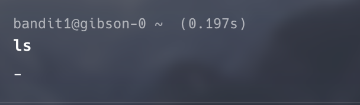
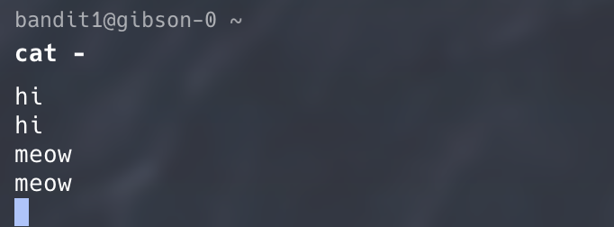
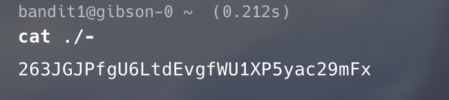

```
oh so you want to read from keyboard? 
```

### initial thoughts
As always, we start with the classic: `ls -la`.  
Boom—there it is. A mysterious file literally named `-`.



Naturally, your first instinct is to run `cat -` and hope a flag pops out.  
But nope. Plot twist: in Linux, `-` is a special token that means _“read from stdin/stdout.”_

So instead of showing the file, `cat -` basically goes:  
“Oh, you want me to read… your keyboard? Sure buddy.”  
And then it just parrots whatever you type.



### So what do we do?
This challenge is basically trolling you with a cursed filename.  
The workaround? **Escape the filename by giving Linux the actual path**, so it won’t interpret `-` as an option. Extended reading: [relative vs absolute path](relative_absolute_path.md)

Tell Linux, “No no, not stdin — _the file._”  
Relative or absolute path, both work.

### here is the solution command
`cat ./-` (relative path)
`cat /home/bandit1/-` (full path)


And just like that — boom, flag revealed.



